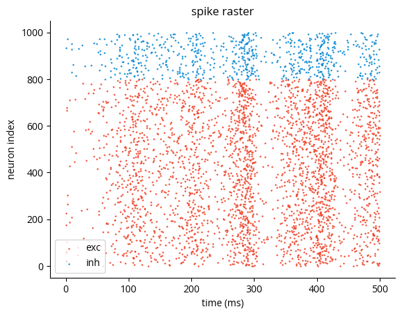
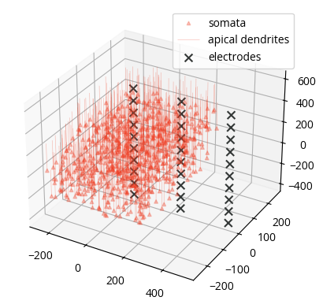
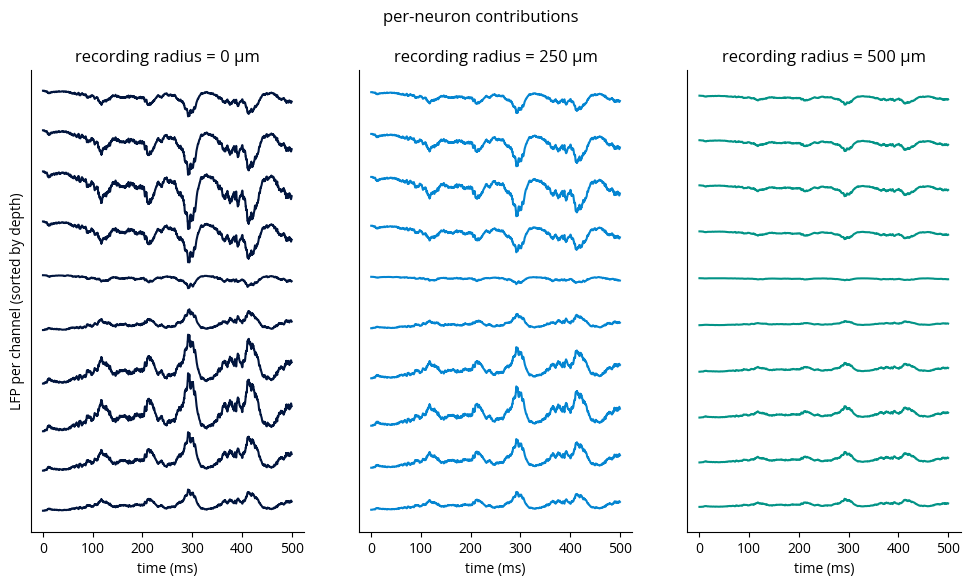
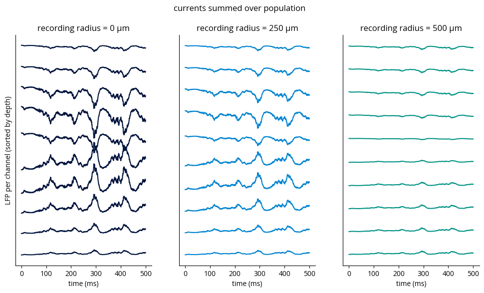

# wslfp

This is a lightweight package for computing the LFP proxy from [Mazzoni, Lindén *et al*., 2015](https://journals.plos.org/ploscompbiol/article?id=10.1371/journal.pcbi.1004584). 

According to Mazzoni et al., 2015, the WSLFP method is a good proxy for LFP when:
- There's enough network activity for the LFP to be sizable
- Morphologies are sufficiently "pyramidal," i.e., the centers of GABA and AMPA dendritic bushes are sufficiently separated ($\geq 150$ μm)


## Installation
Simply install from pypi:
```bash
pip install wslfp
```

## Usage
Keep reading for an end-to-end demo, but here's the gist of it:

```python
import wslfp

# initialize calculator from electrode and current source coordinates
lfp_calc = wslfp.from_xyz_coords(elec_coords, [neuron|population_center]_coords, amp_func=wslfp.mazzoni15)

# get currents
################
# from simulation
t_ms = syn_monitor.t / b2.ms
I_ampa = syn_monitor.I_ampa.T
I_gaba = syn_monitor.I_gaba.T

# or from spikes
I_ampa = wslfp.spikes_to_biexp_currents(t_ms, t_spk_exc, i_spk_exc, J, 2, 0.4)
I_gaba = wslfp.spikes_to_biexp_currents(t_ms, t_spk_inh, i_spk_inh, J, 5, 0.25)

# calculate LFP
lfp = lfp_calc.calculate(
    t_eval_ms=t_ms,
    t_ampa_ms=t_ms,
    I_ampa=I_ampa,
    t_gaba_ms=t_ms,
    I_gaba=I_gaba,
)
```


### Point neuron network simulation

First we need a point neuron simulation to approximate the LFP for.
We'll use a balanced E/I network implementation [from the Neuronal Dynamics textbook](https://neuronaldynamics-exercises.readthedocs.io/en/latest/_modules/neurodynex3/brunel_model/LIF_spiking_network.html#simulate_brunel_network).
Note that we record synaptic currents only from pyramidal cells, since contributions from interneurons are insignificant.

🚧 TODO: get currents from external input as well

<details>
<summary>🔍 Click to see Brian simulation code</summary>


```python
import brian2.only as b2
import matplotlib.pyplot as plt
import numpy as np

b2.prefs.codegen.target = "numpy"
b2.seed(18470724)
rng = np.random.default_rng(18470724)
```


```python
N_excit = 800
N_inhib = None  # None = N_excit / 4
N_extern = 1000
connection_probability = 0.1
# w0 = 0.1 * b2.mV
w0 = 0.07 * b2.nA
g = 4
synaptic_delay = 1.5 * b2.ms
# poisson_input_rate = 13 * b2.Hz
poisson_input_rate = 9 * b2.Hz
# w_external = None
w_external = 0.1 * b2.mV
v_rest = -70 * b2.mV
v_reset = -60 * b2.mV
firing_threshold = -50 * b2.mV
membrane_time_scale = 20 * b2.ms
Rm = 100 * b2.Mohm
abs_refractory_period = 2 * b2.ms
random_vm_init = True

if N_inhib is None:
    N_inhib = int(N_excit / 4)
N_tot = N_excit + N_inhib
if N_extern is None:
    N_extern = int(N_excit * connection_probability)
if w_external is None:
    w_external = w0

J_excit = w0
J_inhib = -g * w0

lif_dynamics = """
    dv/dt = (-(v-v_rest) + Rm*(I_ampa + I_gaba)) / membrane_time_scale : volt (unless refractory)
    I_ampa : amp
    I_gaba : amp
"""

syn_eqs = """
    dI_syn_syn/dt = (s - I_syn)/tau_dsyn : amp
    I_syn_post = I_syn_syn : amp (summed)
    ds/dt = -s/tau_rsyn : amp
"""

neurons = b2.NeuronGroup(
    N_tot,
    model=lif_dynamics,
    threshold="v>firing_threshold",
    reset="v=v_reset",
    refractory=abs_refractory_period,
    method="linear",
)
if random_vm_init:
    neurons.v = (
        np.random.uniform(
            v_rest / b2.mV, high=firing_threshold / b2.mV, size=(N_excit + N_inhib)
        )
        * b2.mV
    )
else:
    neurons.v = v_rest
excitatory_population = neurons[:N_excit]
inhibitory_population = neurons[N_excit:]

exc_synapses = b2.Synapses(
    excitatory_population,
    target=neurons,
    model="""
        dI_syn_syn/dt = (s - I_syn_syn)/tau_dsyn : amp
        I_ampa_post = I_syn_syn : amp (summed)
        ds/dt = -s/tau_rsyn : amp
    """,
    on_pre="s += J_excit",
    delay=synaptic_delay,
    namespace={"tau_rsyn": 0.4 * b2.ms, "tau_dsyn": 2 * b2.ms},
)
exc_synapses.connect(p=connection_probability)

inhib_synapses = b2.Synapses(
    inhibitory_population,
    target=neurons,
    model="""
        dI_syn_syn/dt = (s - I_syn_syn)/tau_dsyn : amp
        I_gaba_post = I_syn_syn : amp (summed)
        ds/dt = -s/tau_rsyn : amp
    """,
    on_pre="s += J_inhib",
    delay=synaptic_delay,
    namespace={"tau_rsyn": 0.25 * b2.ms, "tau_dsyn": 5 * b2.ms},
)
inhib_synapses.connect(p=connection_probability)

external_poisson_input = b2.PoissonInput(
    target=neurons,
    target_var="v",
    N=N_extern,
    rate=poisson_input_rate,
    weight=w_external,
)

spike_monitor = b2.SpikeMonitor(neurons, record=True)
current_monitor = b2.StateMonitor(neurons, ["I_ampa", "I_gaba"], record=range(N_excit))

net = b2.Network(
    neurons,
    exc_synapses,
    inhib_synapses,
    external_poisson_input,
    spike_monitor,
    current_monitor,
)

net.run(0.5 * b2.second)
```

    INFO       The synaptic equation for the variable I_syn_syn does not specify whether it should be integrated at every timestep ('clock-driven') or only at spiking events ('event-driven'). It will be integrated at every timestep which can slow down your simulation unnecessarily if you only need the values of this variable whenever a spike occurs. Specify the equation as clock-driven explicitly to avoid this warning. [brian2.synapses.synapses.clock_driven]
    INFO       The synaptic equation for the variable s does not specify whether it should be integrated at every timestep ('clock-driven') or only at spiking events ('event-driven'). It will be integrated at every timestep which can slow down your simulation unnecessarily if you only need the values of this variable whenever a spike occurs. Specify the equation as clock-driven explicitly to avoid this warning. [brian2.synapses.synapses.clock_driven]


    INFO       No numerical integration method specified for group 'synapses_1', using method 'exact' (took 0.25s). [brian2.stateupdaters.base.method_choice]
    INFO       No numerical integration method specified for group 'synapses', using method 'exact' (took 0.12s). [brian2.stateupdaters.base.method_choice]


</details>


```python
fig, ax = plt.subplots()
c_exc = "xkcd:tomato"
c_inh = "xkcd:cerulean"
t_spk_exc = spike_monitor.t[spike_monitor.i < N_excit] / b2.ms
i_spk_exc = spike_monitor.i[spike_monitor.i < N_excit]
t_spk_inh = spike_monitor.t[spike_monitor.i >= N_excit] / b2.ms
i_spk_inh = spike_monitor.i[spike_monitor.i >= N_excit]
ax.scatter(t_spk_exc, i_spk_exc, s=0.5, c=c_exc)
ax.scatter(t_spk_inh, i_spk_inh, s=0.5, c=c_inh)
ax.set(xlabel="time (ms)", ylabel="neuron index");
```


    

    


### Neuron and electrode coordinates
Let's give our neurons coordinates in space and choose recording sites.
Again, since only synaptic currents onto pyramidal cells contribute significantly to LFP, we'll ignore interneurons.


```python
exc_coords = rng.uniform(-250, 250, (N_excit, 3))
exc_coords[:5]
```


    array([[ 104.6606786 ,  205.54732892, -148.12166896],
           [ -43.94925826,  -10.14448589,  241.31175062],
           [-210.4378934 ,   93.42302493,  148.58298887],
           [ 206.65832644,   24.76391578,  213.96022925],
           [  66.21804613,   77.7437387 ,   32.07423479]])


```python
rec_radii = np.array([0, 250, 500])
elec_coords = np.meshgrid(rec_radii, [0], np.linspace(-400, 600, 10))
elec_coords = np.column_stack([a.flatten() for a in elec_coords])
elec_coords[0:10]
```


    array([[   0.        ,    0.        , -400.        ],
           [   0.        ,    0.        , -288.88888889],
           [   0.        ,    0.        , -177.77777778],
           [   0.        ,    0.        ,  -66.66666667],
           [   0.        ,    0.        ,   44.44444444],
           [   0.        ,    0.        ,  155.55555556],
           [   0.        ,    0.        ,  266.66666667],
           [   0.        ,    0.        ,  377.77777778],
           [   0.        ,    0.        ,  488.88888889],
           [   0.        ,    0.        ,  600.        ]])


```python
from mpl_toolkits.mplot3d.art3d import Line3DCollection

fig = plt.figure()
ax = fig.add_subplot(projection="3d")
apex_coords = exc_coords + [0, 0, 250]
ax.scatter(*exc_coords.T, marker="^", color=c_exc, label="somata", alpha=0.3, s=10)
apical_dendrites = np.stack([exc_coords, apex_coords], axis=1)
assert apical_dendrites.shape == (N_excit, 2, 3)

# The most efficient way to plot multiple lines at once:
lines = Line3DCollection(
    apical_dendrites, color=c_exc, alpha=0.3, label="apical dendrites", linewidth=0.5
)
ax.add_collection(lines)

ax.scatter(
    *elec_coords.T, marker="x", alpha=1, s=50, color="xkcd:charcoal", label="electrodes"
)
ax.legend()
```


    <matplotlib.legend.Legend at 0x7fedd1ff4bc0>


    

    


### Calculator initialization

Now we initialize a `WSLFPCalculator` object which stores parameter settings and the contributions from each source to the total LFP, facilitating repeated calls for real-time use.
We can either follow Mazzoni, Lindén *et al.*'s original approach of aggregating currents over the whole population, or treat each neuron as a separate current source.
The `WSLFPCalculator` computes relative coordinates between electrodes and current sources and stores the amplitude contribution of each source to the total signal.

Different amplitude profiles are available and can be specified via the `amp_func` parameter:
- `mazzoni15`: derived from [Fig. 2B of the original paper](https://doi.org/10.1371/journal.pcbi.1004584.g002).
    The most accurate option since it was based on detailed simulations.
    It is most appropriate when each source represents a population of neurons since that is how the data was produced.
- `mazzoni15_single`: has the same shape as `mazzoni15`, but is optimally shrunk so that the profile of individual neurons averaged out over a 250 μm-radius cylinder produces the population profile.
- `aussel18`: uses the equation for contributions from individual neurons as described in [Aussel *et al.*, 2018](https://doi.org/10.1007/s10827-018-0704-x).

For a detailed comparison, see [`amplitude_comparison.ipynb`](notebooks/amplitude_comparison.ipynb).

Electrode and pyramidal cell (or population center) coordinates are $N \times 3$ arrays and are given in μm.
By default, it is assumed the current source coordinates represent the pyramidal cell somata, though the dipole center can be specified instead by setting `source_coords_are_somata` to `False`.


In the case your current sources (pyramidal cells or populations) aren't uniformly pointing "up," you can pass a 3D vector of $N \times 3$ array via the `source_orientation` parameter.
The default is `[0, 0, 1]`, indicating that the positive z axis is "up," towards the cortical surface.


```python
import wslfp

wslfp_computer = wslfp.WSLFP.from_xyz_coords(
    elec_coords, exc_coords, amp_func=wslfp.amplitude.aussel18
)
wslfp_computer_pop = wslfp.WSLFP.from_xyz_coords(
    elec_coords, exc_coords.mean(axis=0), amp_func=wslfp.amplitude.mazzoni15
)
```

We then compute the LFP signal from the synaptic currents we recorded during the simulation.
For demonstration purposes, we use again use both the population and per-neuron versions:


```python
t_ms = current_monitor.t / b2.ms
lfp = wslfp_computer.compute(
    t_ms, t_ms, current_monitor.I_ampa.T, t_ms, current_monitor.I_gaba.T
)
```


```python
def plot_lfp(lfp, title=None):
    n_shanks = 3
    n_contacts_per_shank = 10
    fig, axs = plt.subplots(1, n_shanks, sharey=True, figsize=(12, 6))
    for i, color, r_rec, ax in zip(
        range(n_shanks), ["xkcd:navy", "xkcd:cerulean", "xkcd:teal"], rec_radii, axs
    ):
        lfp_for_shank = lfp[
            :, i * n_contacts_per_shank : (i + 1) * n_contacts_per_shank
        ]
        ax.plot(
            t_ms,
            lfp_for_shank + np.arange(n_contacts_per_shank) * 1.1 * np.abs(lfp.max()),
            c=color,
        )
        ax.set(xlabel="time (ms)", yticks=[], title=f"recording radius = {r_rec} µm")

    axs[0].set(ylabel="LFP per channel (sorted by depth)")
    if title:
        fig.suptitle(title)


plot_lfp(lfp, "per-neuron contributions à la Aussel 2018")
```


    

    


```python
lfp_pop = wslfp_computer_pop.compute(
    t_ms,
    t_ms,
    current_monitor.I_ampa.sum(axis=0),
    t_ms,
    current_monitor.I_gaba.sum(axis=0),
)
plot_lfp(lfp_pop, title="currents summed over population à la Mazzoni 2015")
```


    

    


```python
print(len(exc_synapses.j))
print(exc_synapses.N)
# we have as many synapses as expected. Is the number of spikes right?
print(np.mean(exc_synapses.N_outgoing))
print(len(t_spk_exc))
len(t_spk_exc) * np.mean(exc_synapses.N_outgoing)
```

    80638
    <synapses.N: 80638>
    101.6963218333788
    2999


    304987.269178303


### Computing from spikes
`wslfp` provides functions to generate synaptic currents from spikes to avoid having to simulate synaptic dynamics.
Let's compare the results with those above; they should be identical since we convolve the spikes with the exact same postsynaptic current kernels as those simulated as ODEs with Brian (see [`postsynaptic_currents.ipynb`](notebooks/postsynaptic_currents.ipynb) for more background).


```python
# connection matrices can be big; use a sparse matrix to save memory
from scipy import sparse

J = sparse.lil_array((N_tot, N_tot))
J[exc_synapses.i, exc_synapses.j] = J_excit
J[inhib_synapses.i, inhib_synapses.j] = J_inhib
J = J.tocsr()

I_ampa = wslfp.spikes_to_biexp_currents(t_ms, t_spk_exc, i_spk_exc, J, 2, 0.4)
I_gaba = wslfp.spikes_to_biexp_currents(t_ms, t_spk_inh, i_spk_inh, J, 5, 0.25)
lfp_spike = wslfp_computer.compute(t_ms, t_ms, I_ampa, t_ms, I_gaba)
assert np.allclose(lfp, lfp_spike)
```


    ---------------------------------------------------------------------------

    AssertionError                            Traceback (most recent call last)

    Cell In[55], line 11
          9 I_ampa = wslfp.spikes_to_biexp_currents(t_ms, t_spk_exc, i_spk_exc, J, 2, 0.4)
         10 I_gaba = wslfp.spikes_to_biexp_currents(t_ms, t_spk_inh, i_spk_inh, J, 5, 0.25)
    ---> 11 lfp_spike = wslfp_computer.compute(t_ms, t_ms, I_ampa, t_ms, I_gaba)
         12 assert np.allclose(lfp, lfp_spike)


    File ~/Dropbox (GaTech)/projects/wslfp/wslfp/__init__.py:146, in WSLFP.compute(self, t_eval_ms, t_ampa_ms, I_ampa, t_gaba_ms, I_gaba, normalize)
        144 def compute(self, t_eval_ms, t_ampa_ms, I_ampa, t_gaba_ms, I_gaba, normalize=True):
        145     I_ampa = np.reshape(I_ampa, (-1, self.n_sources))
    --> 146     assert I_ampa.shape == (
        147         len(t_ampa_ms),
        148         self.n_sources,
        149     ), f"{I_ampa.shape} != ({len(t_ampa_ms)}, {self.n_sources})"
        150     I_gaba = np.reshape(I_gaba, (-1, self.n_sources))
        151     assert I_gaba.shape == (
        152         len(t_gaba_ms),
        153         self.n_sources,
        154     ), f"{I_gaba.shape} != ({len(t_gaba_ms)}, {self.n_sources})"


    AssertionError: (6250, 800) != (5000, 800)


```python
import numba


@numba.njit
def test(a, b):
    return a * (b > 0)


test(np.array([1, 2, 3, 4]), np.array([0, 1, 0, 1]))
```


    array([0, 2, 0, 4])


```python
I_ampa = wslfp.spikes_to_biexp_currents(
    t_ms[2160:2161], t_spk_exc, i_spk_exc, J, 2, 0.4
)
I_ampa
```

    1758


    array([[            nan,             nan,  1.17959333e-10,
             7.97767644e-11,             nan,             nan,
                        nan, -1.08470085e-10,             nan,
                        nan,  4.72867460e-11,             nan,
                        nan,             nan,             nan,
                        nan,             nan,             nan,
                        nan,  1.22601338e-10,  3.15527576e-11,
                        nan,             nan,             nan,
                        nan,             nan,             nan,
                        nan,             nan,             nan,
                        nan,  2.64101057e-11,             nan,
                        nan,             nan,  5.83779495e-11,
                        nan,             nan,             nan,
                        nan,             nan,             nan,
                        nan, -4.72121256e-11,             nan,
                        nan,             nan,  1.27525314e-11,
                        nan,             nan,             nan,
                        nan,             nan,             nan,
                        nan,             nan,             nan,
                        nan,             nan,             nan,
                        nan,             nan, -1.14678450e-10,
                        nan,             nan,             nan,
             8.79773348e-12,  4.31005567e-11,  4.41411338e-11,
                        nan,  1.34647195e-10,             nan,
                        nan,             nan,             nan,
                        nan,             nan,             nan,
                        nan,             nan, -4.61022895e-11,
                        nan,             nan,             nan,
                        nan,             nan,             nan,
                        nan,             nan,             nan,
                        nan,             nan,             nan,
                        nan,             nan,             nan,
                        nan,             nan,             nan,
                        nan,             nan,  9.15561074e-11,
                        nan,  3.08504168e-11,             nan,
                        nan,             nan,             nan,
                        nan,  7.13445795e-11,             nan,
                        nan,  6.67876197e-11, -7.15201340e-13,
                        nan,             nan,  6.91384574e-11,
                        nan,             nan,             nan,
                        nan,             nan,             nan,
                        nan,             nan,             nan,
                        nan,  5.25677325e-11,             nan,
            -3.06567681e-11,             nan,             nan,
            -8.67421570e-12,             nan,             nan,
                        nan,             nan,             nan,
                        nan, -8.02394936e-11,             nan,
                        nan,             nan,             nan,
                        nan,             nan,  8.85883222e-11,
                        nan,             nan,             nan,
                        nan,             nan, -1.27182399e-10,
                        nan,             nan,             nan,
                        nan,  5.68532000e-11,             nan,
                        nan,             nan, -2.76454286e-10,
                        nan,             nan,             nan,
                        nan,             nan,  2.90094019e-11,
                        nan,             nan,             nan,
                        nan,             nan,             nan,
                        nan,  1.24625967e-10,             nan,
             1.02568142e-10,             nan,             nan,
                        nan,             nan,             nan,
                        nan,             nan,             nan,
                        nan,             nan,             nan,
                        nan,             nan,             nan,
                        nan, -7.79309995e-11,             nan,
                        nan,             nan,             nan,
                        nan,             nan,             nan,
                        nan,             nan,             nan,
             5.48653650e-11,             nan,             nan,
                        nan,             nan,             nan,
                        nan,             nan,  1.37297336e-10,
                        nan,             nan,             nan,
                        nan,             nan,             nan,
             1.20216493e-10,             nan,             nan,
                        nan,             nan,             nan,
                        nan,             nan,             nan,
                        nan,             nan,             nan,
             2.77599661e-11,             nan,             nan,
                        nan,  2.16132974e-11,  2.88856818e-11,
                        nan,             nan,             nan,
                        nan,  1.31211515e-11,             nan,
                        nan,  1.19046176e-11,             nan,
                        nan,             nan, -5.69270489e-11,
                        nan,             nan,             nan,
                        nan, -7.86962861e-11,             nan,
                        nan,             nan,  8.01213272e-11,
                        nan,             nan, -1.15679515e-10,
                        nan,             nan,             nan,
                        nan,             nan,             nan,
             8.62196860e-11,             nan,             nan,
                        nan,             nan,             nan,
             5.41228059e-11,             nan,             nan,
                        nan,             nan,             nan,
                        nan, -1.18398257e-10,             nan,
                        nan,             nan,             nan,
                        nan,  6.62941011e-12,             nan,
            -4.84677783e-12,             nan, -1.49556023e-10,
            -4.90218690e-11,             nan,             nan,
                        nan,             nan,             nan,
                        nan,             nan,  3.37652635e-11,
                        nan,             nan,             nan,
             6.18256047e-11,             nan,             nan,
                        nan,             nan,             nan,
            -5.72851669e-11,             nan,             nan,
                        nan,             nan,             nan,
                        nan,             nan, -5.28898746e-13,
                        nan,             nan,             nan,
                        nan,             nan,             nan,
                        nan, -2.58653556e-10,             nan,
            -4.94542669e-11,             nan,             nan,
                        nan,             nan, -5.81094860e-11,
                        nan,             nan,             nan,
                        nan,             nan,             nan,
                        nan,             nan,             nan,
                        nan,             nan,             nan,
                        nan,             nan,             nan,
            -1.07870733e-10,             nan,             nan,
                        nan,             nan,  9.11731664e-11,
                        nan,             nan,  7.02243904e-11,
                        nan,             nan,             nan,
                        nan,             nan, -8.86578270e-12,
                        nan,             nan,             nan,
                        nan,             nan,             nan,
                        nan,             nan,             nan,
                        nan,             nan,             nan,
             8.02309099e-11,  7.21076677e-11,             nan,
                        nan,             nan,  3.25856407e-11,
                        nan,             nan,             nan,
            -4.84844539e-11,             nan,             nan,
             8.11641635e-11, -3.45913048e-11,  3.76471656e-11,
                        nan,             nan,             nan,
                        nan,             nan,             nan,
                        nan,             nan,             nan,
                        nan,             nan,             nan,
                        nan,             nan,             nan,
                        nan,             nan,             nan,
                        nan,             nan,             nan,
                        nan,             nan,             nan,
                        nan,             nan,             nan,
                        nan,             nan,             nan,
             6.94327983e-11,             nan,             nan,
                        nan,             nan,             nan,
             5.49537227e-11, -1.12029587e-10,             nan,
                        nan,             nan,             nan,
                        nan,             nan,             nan,
                        nan,             nan,             nan,
            -2.40909276e-10,             nan,             nan,
                        nan,             nan,             nan,
                        nan,             nan,             nan,
                        nan,             nan,  2.98860047e-11,
                        nan,             nan,             nan,
                        nan,  6.28872865e-11,             nan,
                        nan,             nan,             nan,
                        nan,  7.05548496e-11,             nan,
                        nan,             nan,             nan,
                        nan,             nan,             nan,
                        nan,             nan,             nan,
             1.18681706e-11,             nan,             nan,
                        nan,             nan,             nan,
                        nan,             nan,             nan,
                        nan,             nan,             nan,
                        nan, -1.24132798e-11,             nan,
                        nan,  7.10885641e-11,             nan,
                        nan,             nan,  6.23807321e-11,
                        nan,             nan,             nan,
                        nan, -3.40448635e-11,             nan,
                        nan,  1.33378130e-10,             nan,
                        nan,             nan,             nan,
                        nan,             nan,             nan,
                        nan,             nan,             nan,
            -4.32335949e-11,             nan,             nan,
                        nan,             nan,             nan,
                        nan,             nan,             nan,
                        nan,             nan,             nan,
                        nan,             nan,             nan,
             1.43533312e-10,             nan,             nan,
             3.30410884e-11,             nan,             nan,
             8.71136055e-11,             nan, -6.31249049e-11,
                        nan,             nan,             nan,
                        nan,             nan,             nan,
                        nan, -2.15317076e-11,             nan,
             2.48107962e-12,             nan,  1.11473783e-10,
                        nan,             nan,             nan,
             6.13340577e-11,             nan,             nan,
                        nan,  7.63036305e-11,             nan,
                        nan,             nan,             nan,
                        nan,  3.27613451e-11, -1.33905154e-10,
                        nan,  2.22079813e-11,             nan,
                        nan,             nan, -7.10214982e-11,
             1.00435408e-10,  1.08574369e-11,             nan,
            -3.76873458e-11,             nan,             nan,
                        nan,             nan,             nan,
                        nan,             nan,  4.34312840e-11,
                        nan,             nan,             nan,
                        nan,             nan,  4.85153410e-11,
                        nan,             nan,             nan,
                        nan,             nan,  1.11031920e-10,
                        nan,             nan, -6.54030783e-12,
                        nan,             nan,  9.44439501e-11,
                        nan,             nan,             nan,
             5.75979992e-11,             nan,             nan,
                        nan,             nan,             nan,
                        nan,  3.12825060e-11,             nan,
             1.03585570e-10,             nan,             nan,
                        nan,             nan,             nan,
            -1.47436601e-10,  8.19205671e-11,             nan,
                        nan,             nan,             nan,
                        nan,             nan,             nan,
                        nan,  7.17836856e-11,  5.08146899e-11,
                        nan,             nan,             nan,
                        nan,             nan,             nan,
                        nan,             nan, -1.42620932e-11,
                        nan,             nan,             nan,
                        nan,             nan,             nan,
                        nan,             nan,             nan,
                        nan,  5.66752872e-11,             nan,
                        nan,             nan,             nan,
                        nan,             nan,             nan,
                        nan,             nan, -3.41638312e-11,
                        nan,             nan,             nan,
                        nan,             nan,  4.78947650e-11,
                        nan,             nan,  4.44748062e-11,
                        nan,             nan,             nan,
                        nan,             nan,             nan,
                        nan,             nan,             nan,
                        nan,             nan,             nan,
                        nan,             nan,             nan,
                        nan,             nan,             nan,
                        nan,             nan,             nan,
             9.71642102e-11, -3.75040920e-12,             nan,
             4.76926031e-11,             nan,             nan,
                        nan,             nan,             nan,
                        nan, -3.39449912e-11,  1.11436518e-10,
                        nan,             nan,             nan,
                        nan,             nan,             nan,
                        nan,             nan,  7.29840105e-11,
                        nan,             nan,             nan,
                        nan,             nan,             nan,
                        nan,             nan,  2.06243372e-11,
                        nan,             nan,             nan,
                        nan,             nan,             nan,
                        nan,             nan,             nan,
             3.51494055e-11,             nan,             nan,
                        nan,             nan,             nan,
            -4.56274173e-11,             nan, -7.12031178e-11,
                        nan,             nan,             nan,
                        nan,             nan,  2.72831256e-11,
                        nan,             nan,             nan,
                        nan,             nan,             nan,
                        nan,             nan,             nan,
                        nan,             nan,  1.28358283e-10,
             9.51677883e-11, -9.60998831e-12,             nan,
             2.24373789e-11,             nan,             nan,
                        nan,  4.55998515e-12,  9.20073174e-11,
                        nan,             nan,             nan,
                        nan,             nan,             nan,
                        nan,             nan,             nan,
                        nan,  9.78660249e-11,             nan,
                        nan,             nan,             nan,
                        nan,             nan,             nan,
                        nan,             nan,             nan,
                        nan, -5.54943557e-12,             nan,
             6.60120469e-11,             nan,             nan,
            -2.91957512e-10,             nan,             nan,
            -1.06945409e-10,             nan,             nan,
             1.61039193e-10,             nan,             nan,
                        nan,             nan,             nan,
                        nan,             nan,             nan,
                        nan,             nan,             nan,
                        nan,             nan, -1.20878890e-10,
                        nan,  4.25749687e-11,             nan,
                        nan,             nan,             nan,
                        nan,             nan,  4.12861895e-11,
            -1.87274995e-10,             nan,             nan,
                        nan,             nan,             nan,
             7.09905860e-12,             nan,             nan,
                        nan,             nan,             nan,
                        nan, -1.18284435e-10,             nan,
                        nan,             nan,             nan,
                        nan,             nan,             nan,
             1.02881332e-10,             nan,             nan,
            -1.44767240e-11,             nan,             nan,
                        nan,  9.15534510e-11,             nan,
                        nan,  3.51081993e-11,             nan,
                        nan,             nan,             nan,
                        nan,             nan,             nan,
                        nan,             nan,  5.57117019e-11,
                        nan,             nan,             nan,
                        nan,             nan,             nan,
                        nan,             nan,  6.76766119e-11,
                        nan,             nan,             nan,
                        nan, -8.04960775e-11,  5.38078971e-11,
             3.61234446e-11,             nan,             nan,
                        nan,             nan,             nan,
                        nan,             nan,  6.15307184e-11,
                        nan,             nan,             nan,
                        nan,             nan,             nan,
                        nan,             nan,             nan,
                        nan,  3.20538386e-11,             nan,
                        nan,  3.86718585e-11,             nan,
             8.28112468e-11,  5.67140057e-11,             nan,
                        nan,             nan,  9.28605245e-11,
                        nan,             nan,             nan,
                        nan,             nan,             nan,
                        nan,             nan,             nan,
            -1.26599724e-11,             nan,             nan,
                        nan,             nan,             nan,
                        nan, -1.12909829e-10,             nan,
                        nan,             nan,             nan,
                        nan,  1.99724419e-11,             nan,
                        nan,             nan,             nan,
                        nan,             nan,  2.69592073e-11,
                        nan,             nan,  4.75475064e-11,
                        nan,             nan,             nan,
                        nan,             nan,             nan,
                        nan,             nan,             nan,
                        nan,             nan,             nan,
                        nan,             nan,             nan,
                        nan,             nan,             nan,
                        nan,             nan,             nan,
                        nan, -6.47043350e-11,             nan,
                        nan,             nan,             nan,
             6.38267742e-11,             nan,             nan,
                        nan,             nan,             nan,
             1.33298939e-10,             nan,             nan,
                        nan,             nan,             nan,
                        nan,             nan,             nan,
                        nan, -1.84362520e-10,             nan,
                        nan,             nan,             nan,
                        nan,             nan,             nan,
                        nan,             nan,             nan,
                        nan,             nan,             nan,
                        nan, -4.04413131e-11,             nan,
                        nan]])


```python
np.any(np.isnan(I_ampa), axis=1)[2160]
```


    True


```python
t_ms.shape
```


    (5000,)


```python
I_ampa_pop = wslfp.spikes_to_biexp_currents(t_ms, t_spk_exc, i_spk_exc, J_excit, 2, 0.4)
I_gaba_pop = wslfp.spikes_to_biexp_currents(
    t_ms, t_spk_inh, i_spk_inh, J_inhib, 5, 0.25
)
lfp_spike_pop = wslfp_computer_pop.compute()
lfp_spike = wslfp_computer.compute(t_ms, t_ms, I_ampa, t_ms, I_gaba)
assert np.allclose(lfp, lfp_spike)
```

## Future development
These features might be useful to add in the future:
- amplitude and $alpha$ that vary by axon length as well as by recording position
